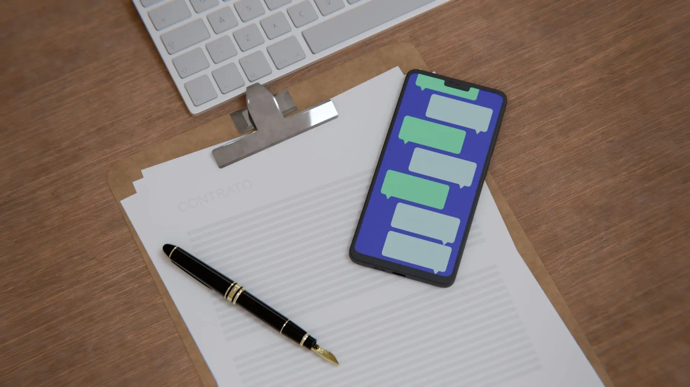
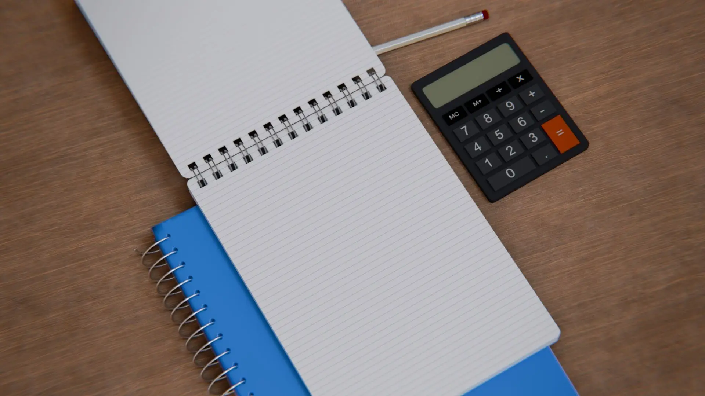
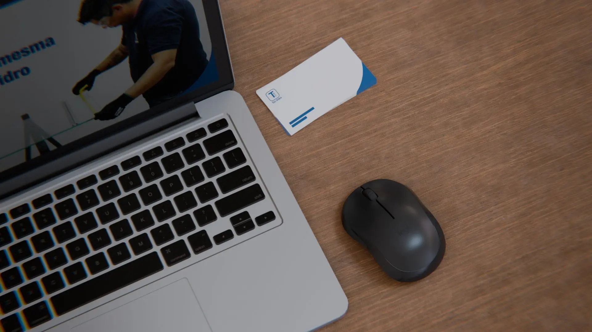
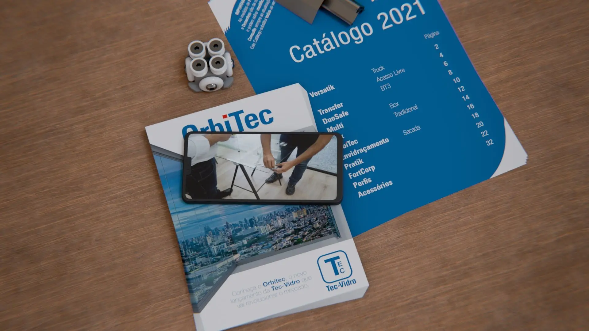

import YouTubeBlock from "../../../components/YouTubeBlock.astro";

Animações 3D criadas usando **Blender** e **DaVinci Resolve** para uma campanha
de marketing em redes sociais. Este projeto envolveu design e _motion graphics_
envolventes, otimização visual para múltiplas plataformas e o aprimoramento da
comunicação da marca através de animações dinâmicas.

<YouTubeBlock videoId="_jwYSCZdsu8" />

