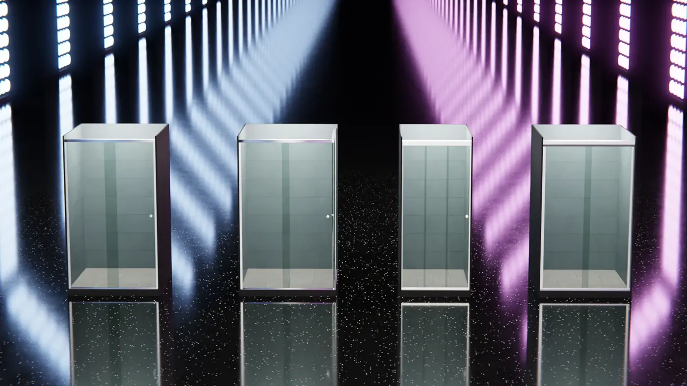
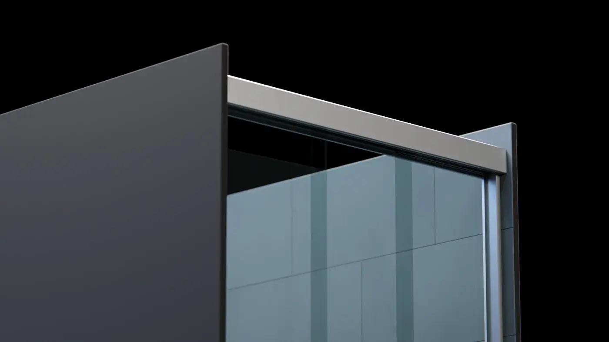
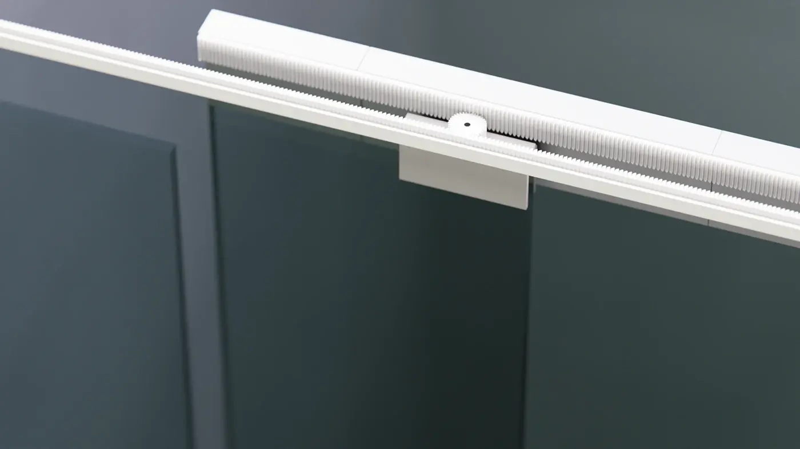
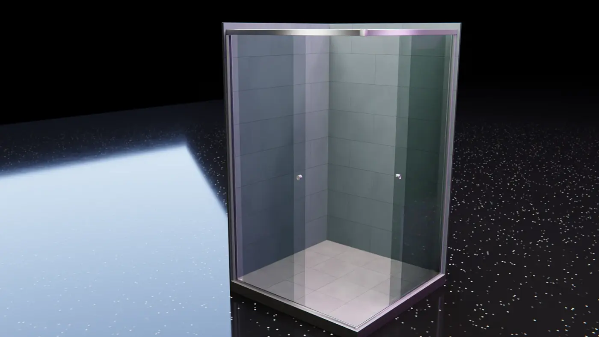
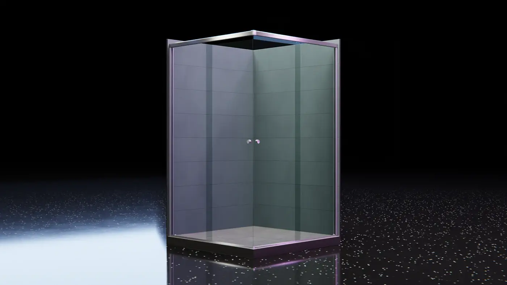
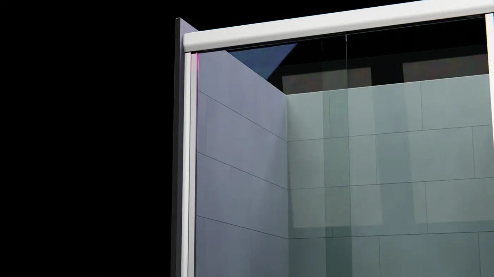
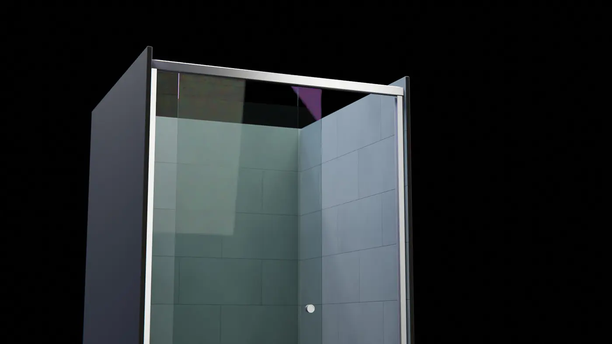

import YouTubeBlock from "../../../components/YouTubeBlock.astro";

Renderizações 3D e animação para visualização e apresentação de produtos.
Modelado e renderizado usando **Blender**, composição e edição feitas no
**Davinci Resolve**.

<YouTubeBlock videoId="7rEWTGyesa0" />

