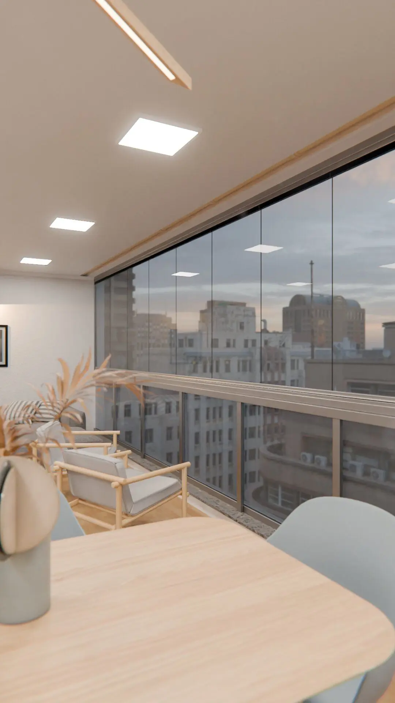
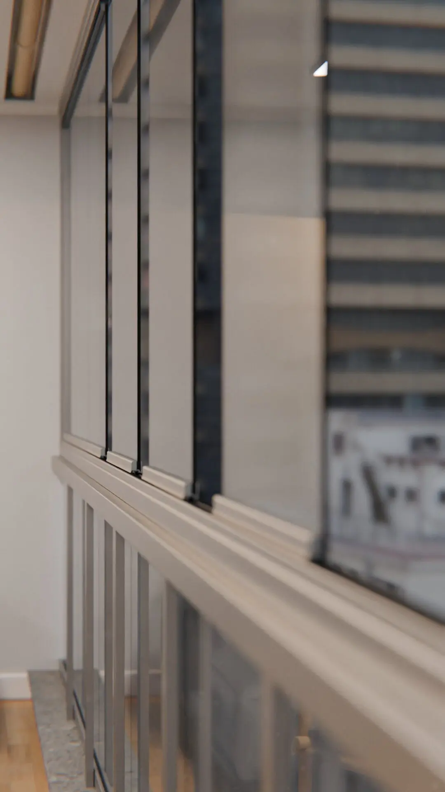

This project showcases a realistic 3D visualization of a modern balcony glazing
system, created in Blender.

The focus of the render is on aluminum glazing profiles, accurately modeled to
demonstrate their installation, structure, and material quality in a residential
balcony environment.

The visualization highlights clean architectural lines, realistic materials, and
natural lighting, making it suitable for architectural presentations, real
estate marketing, and product visualization.

