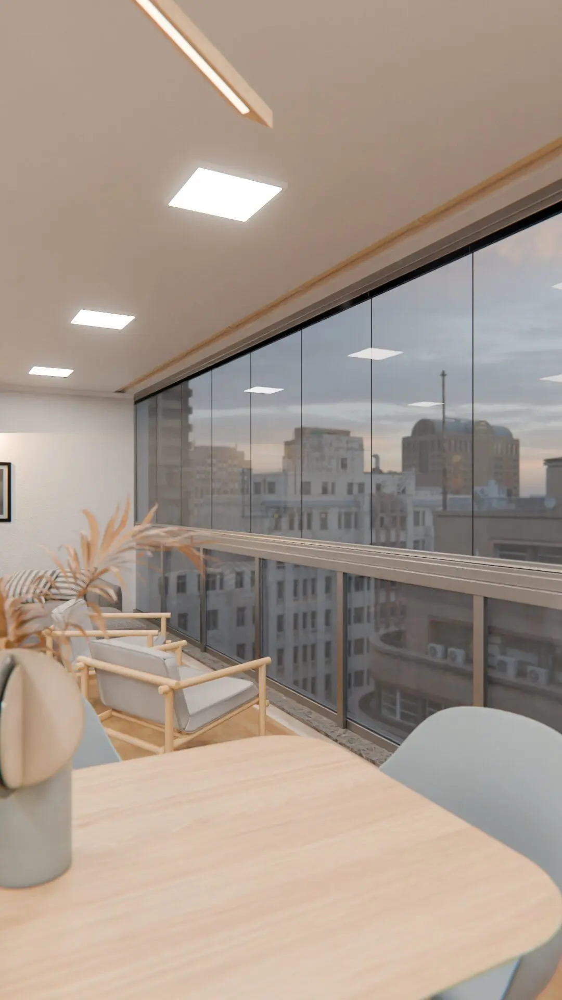
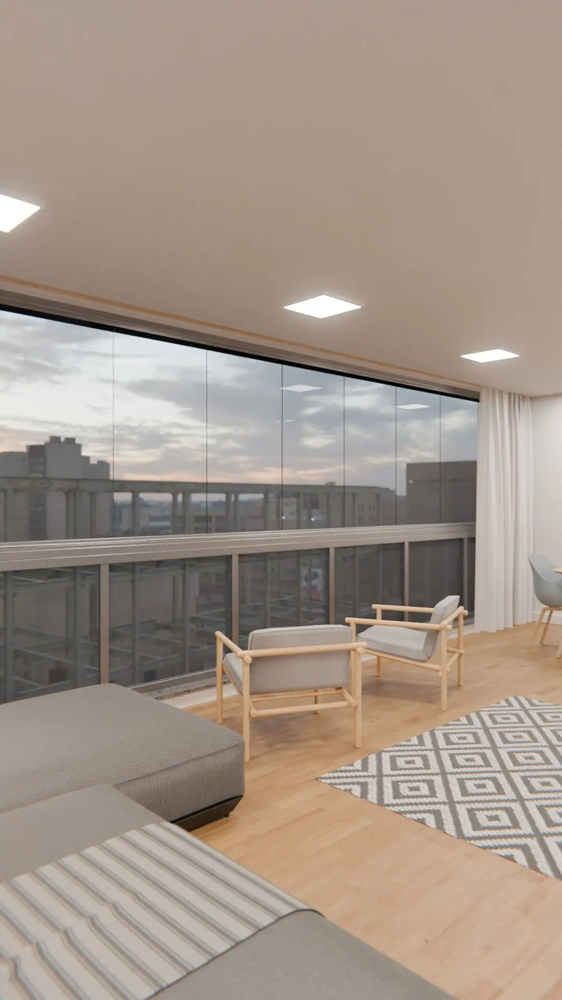
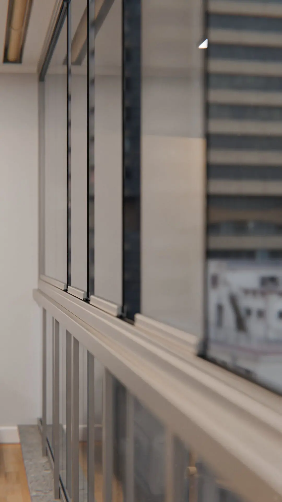
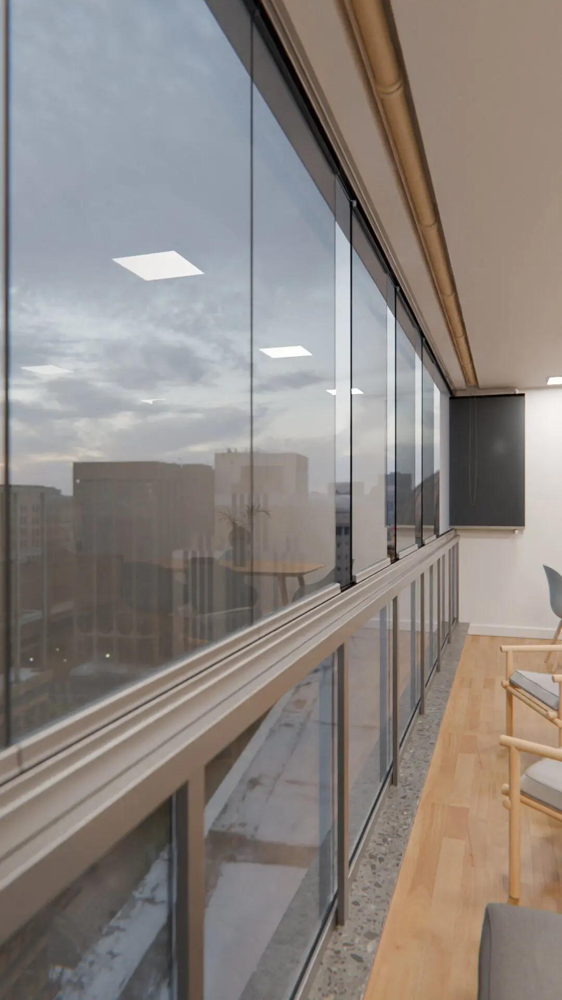

Este projeto apresenta uma visualização 3D realista de um sistema moderno de
esquadrias de varanda, criado no **Blender**.

O foco da renderização está nos perfis de alumínio, modelados com precisão para
demonstrar sua instalação, estrutura e qualidade dos materiais em um ambiente
residencial de varanda.

A visualização destaca linhas arquitetônicas limpas, materiais realistas e
iluminação natural, sendo ideal para apresentações arquitetônicas, marketing
imobiliário e visualização de produtos.

