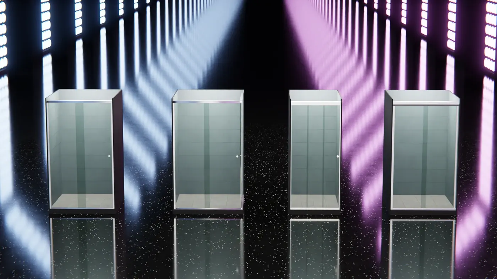
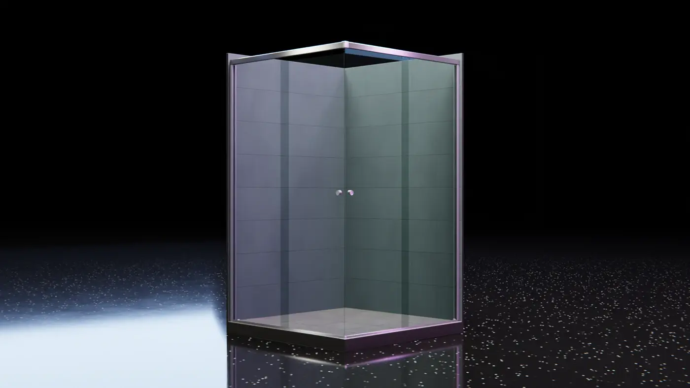

import YouTubeBlock from "../../components/YouTubeBlock.astro";

3D renders and animation for product visualization and presentation. Modeled and
rendered using Blender and compositing and editing made using Davinci Resolve.

<YouTubeBlock videoId="7rEWTGyesa0" />

